Forecasting Models: Inflation
================
Kyle Deng
Last updated at 09 September, 2021

## Calculate the CPI inflation surprise

``` r
data <- fredr("CPIAUCSL", frequency = "q") %>%
  na.omit() %>%
  select(date, value) %>%
  rename(CPIAUCSL = value) %>%
  mutate(cpiaucsl_a = (CPIAUCSL/lag(CPIAUCSL, 4) - 1) * 100,
         cpiaucsl_q = (CPIAUCSL/lag(CPIAUCSL, 1) - 1) * 400,
         back_cpiaucsl_qa = cpiaucsl_q - lag(cpiaucsl_a, 1)) %>%
  filter(date > "1984-10-01")
cpi_inflation <- ts(data$back_cpiaucsl_qa, start = c(1985, 1), end = c(2021, 2), frequency = 4)
```

## Plot the CPI inflation surprise

``` r
date <- seq(data$date[1], data$date[146], by = '+3 month')
cpi_inflation_surprise <- xts(data$back_cpiaucsl_qa, order.by = date)
plot(cpi_inflation_surprise, main = "CPI inflation surprise")
```

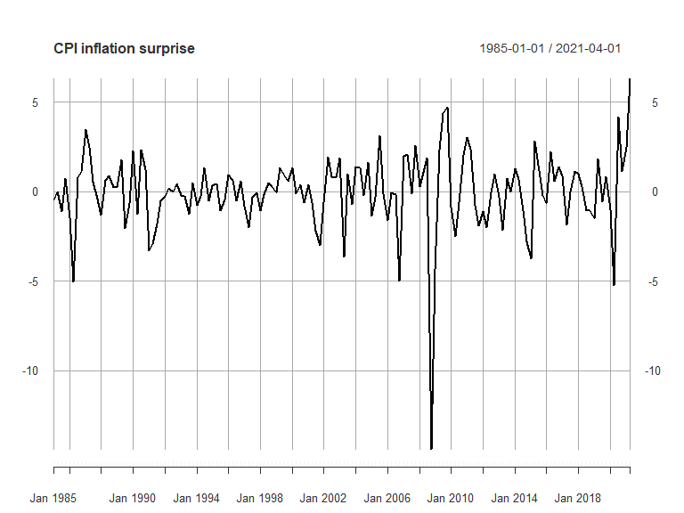<!-- -->
\# ARMA \#\# Check the ACF and PACF plots

``` r
aux <- acf2(cpi_inflation)
```

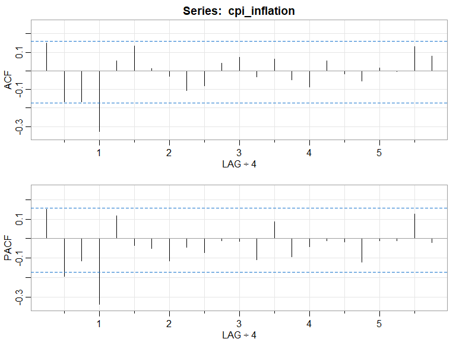<!-- -->

Both the ACF and PACF appear to cut off after lag 1 (1 year), that
suggests that the series may be an ARMA(4,4) model.

``` r
(ARMA44 <- arima(cpi_inflation, order = c(4, 0, 4)))
```

    ## 
    ## Call:
    ## arima(x = cpi_inflation, order = c(4, 0, 4))
    ## 
    ## Coefficients:
    ##          ar1      ar2     ar3      ar4      ma1      ma2      ma3      ma4
    ##       0.2233  -0.2597  0.0950  -0.0114  -0.1841  -0.0912  -0.2349  -0.4898
    ## s.e.  0.2461   0.2235  0.1831   0.1594   0.2306   0.2019   0.2044   0.1470
    ##       intercept
    ##         -0.0610
    ## s.e.     0.0113
    ## 
    ## sigma^2 estimated as 3.461:  log likelihood = -299.91,  aic = 619.82

## Model diagnostic checks

``` r
plot(ARMA44$residuals, ylab = 'Residuals of ARMA(4, 4)')
```

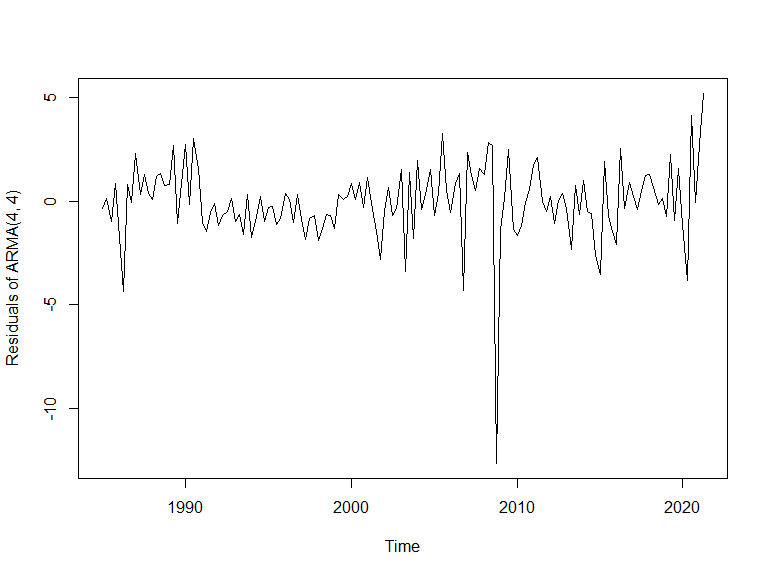<!-- -->

``` r
aux <- acf2(ARMA44$residuals)
```

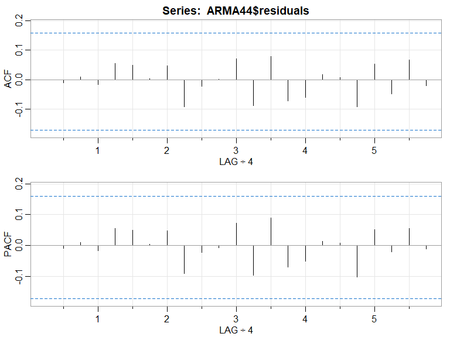<!-- -->

From the residuals vs. time plot, the residuals seem to oscillates
around its mean 0 for the most part, though there are periods where the
variance seems to be quite unstable.

However, the ACF/PACF of the residuals do not show any significant
correlation coefficient.

## Ljung-Box test

``` r
Box.test(ARMA44$residuals, lag = 4, type = c("Ljung-Box"))
```

    ## 
    ##  Box-Ljung test
    ## 
    ## data:  ARMA44$residuals
    ## X-squared = 0.073234, df = 4, p-value = 0.9993

The formal Ljung-Box test confirms that the hypothesis that the
residuals of the model are white noise can not be rejected. Therefore,
the model passes the diagnostic checks.

Based on the BIC, select the 2 “best models” within ARMA(4 ± 2,4 ± 2) in
the training data (80%)

``` r
data$date[nrow(data) * 0.8]
```

    ## [1] "2013-10-01"

``` r
inf.train <- window(cpi_inflation, end = c(2013, 4))
all.AR <- c(2, 3, 4, 5, 6)
all.MA <- c(2, 3, 4, 5, 6)
all.ARMA <- expand.grid(AR = all.AR, MA = all.MA)
n.ARMA <- nrow(all.ARMA)
bicm <- matrix(NA, n.ARMA, 1)
rownames(bicm) <- paste0("ARMA(", all.ARMA$AR,",",
all.ARMA$MA, ")")
colnames(bicm) <- "BIC"
for(i in 1:n.ARMA){
  model = arima(inf.train, order = c(all.ARMA[i, 1], 0, all.ARMA[i, 2]))
  bicm[i, 1] = BIC(model)
}
kable(bicm)
```

<table>
<thead>
<tr>
<th style="text-align:left;">
</th>
<th style="text-align:right;">
BIC
</th>
</tr>
</thead>
<tbody>
<tr>
<td style="text-align:left;">
ARMA(2,2)
</td>
<td style="text-align:right;">
507.1937
</td>
</tr>
<tr>
<td style="text-align:left;">
ARMA(3,2)
</td>
<td style="text-align:right;">
510.2261
</td>
</tr>
<tr>
<td style="text-align:left;">
ARMA(4,2)
</td>
<td style="text-align:right;">
517.2221
</td>
</tr>
<tr>
<td style="text-align:left;">
ARMA(5,2)
</td>
<td style="text-align:right;">
513.2402
</td>
</tr>
<tr>
<td style="text-align:left;">
ARMA(6,2)
</td>
<td style="text-align:right;">
516.3370
</td>
</tr>
<tr>
<td style="text-align:left;">
ARMA(2,3)
</td>
<td style="text-align:right;">
511.3588
</td>
</tr>
<tr>
<td style="text-align:left;">
ARMA(3,3)
</td>
<td style="text-align:right;">
514.6770
</td>
</tr>
<tr>
<td style="text-align:left;">
ARMA(4,3)
</td>
<td style="text-align:right;">
515.7495
</td>
</tr>
<tr>
<td style="text-align:left;">
ARMA(5,3)
</td>
<td style="text-align:right;">
516.9215
</td>
</tr>
<tr>
<td style="text-align:left;">
ARMA(6,3)
</td>
<td style="text-align:right;">
521.0886
</td>
</tr>
<tr>
<td style="text-align:left;">
ARMA(2,4)
</td>
<td style="text-align:right;">
509.6512
</td>
</tr>
<tr>
<td style="text-align:left;">
ARMA(3,4)
</td>
<td style="text-align:right;">
514.1261
</td>
</tr>
<tr>
<td style="text-align:left;">
ARMA(4,4)
</td>
<td style="text-align:right;">
517.7471
</td>
</tr>
<tr>
<td style="text-align:left;">
ARMA(5,4)
</td>
<td style="text-align:right;">
521.6207
</td>
</tr>
<tr>
<td style="text-align:left;">
ARMA(6,4)
</td>
<td style="text-align:right;">
526.3836
</td>
</tr>
<tr>
<td style="text-align:left;">
ARMA(2,5)
</td>
<td style="text-align:right;">
506.5735
</td>
</tr>
<tr>
<td style="text-align:left;">
ARMA(3,5)
</td>
<td style="text-align:right;">
511.3000
</td>
</tr>
<tr>
<td style="text-align:left;">
ARMA(4,5)
</td>
<td style="text-align:right;">
522.4364
</td>
</tr>
<tr>
<td style="text-align:left;">
ARMA(5,5)
</td>
<td style="text-align:right;">
526.3183
</td>
</tr>
<tr>
<td style="text-align:left;">
ARMA(6,5)
</td>
<td style="text-align:right;">
524.7106
</td>
</tr>
<tr>
<td style="text-align:left;">
ARMA(2,6)
</td>
<td style="text-align:right;">
511.3938
</td>
</tr>
<tr>
<td style="text-align:left;">
ARMA(3,6)
</td>
<td style="text-align:right;">
516.0359
</td>
</tr>
<tr>
<td style="text-align:left;">
ARMA(4,6)
</td>
<td style="text-align:right;">
520.7870
</td>
</tr>
<tr>
<td style="text-align:left;">
ARMA(5,6)
</td>
<td style="text-align:right;">
530.2981
</td>
</tr>
<tr>
<td style="text-align:left;">
ARMA(6,6)
</td>
<td style="text-align:right;">
529.0808
</td>
</tr>
</tbody>
</table>

Based on the BIC, the two models selected are ARMA(2,5) and ARMA(2,2).

## Model Estimation

``` r
(ARMA25 <- arima(inf.train, order = c(2, 0, 5)))
```

    ## 
    ## Call:
    ## arima(x = inf.train, order = c(2, 0, 5))
    ## 
    ## Coefficients:
    ##           ar1      ar2     ma1      ma2      ma3      ma4      ma5  intercept
    ##       -1.0468  -0.0871  1.1974  -0.2251  -0.6817  -0.7486  -0.5421    -0.0726
    ## s.e.   0.1895   0.1878  0.1737   0.1930   0.1792   0.1888   0.0833     0.0150
    ## 
    ## sigma^2 estimated as 2.947:  log likelihood = -231.9,  aic = 481.79

``` r
(ARMA22 <- arima(inf.train, order = c(2, 0, 2)))
```

    ## 
    ## Call:
    ## arima(x = inf.train, order = c(2, 0, 2))
    ## 
    ## Coefficients:
    ##          ar1     ar2      ma1      ma2  intercept
    ##       0.3955  0.1407  -0.3669  -0.6331    -0.0745
    ## s.e.  0.2164  0.1904   0.1880   0.1871     0.0173
    ## 
    ## sigma^2 estimated as 3.522:  log likelihood = -239.34,  aic = 490.67

## Diagnostic checks

``` r
plot(ARMA25$residuals, ylab = 'Residuals', main = 'ARMA(2, 5)')
```

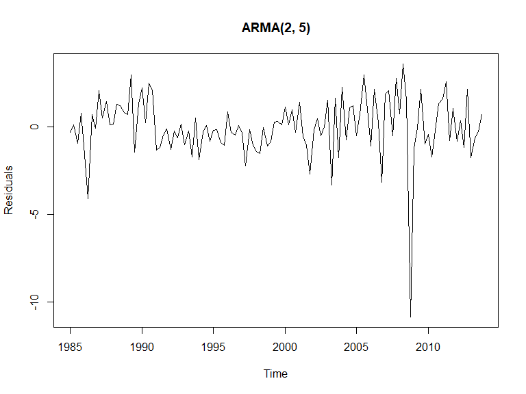<!-- -->

``` r
plot(ARMA22$residuals, ylab = 'Residuals', main = 'ARMA(2, 2)')
```

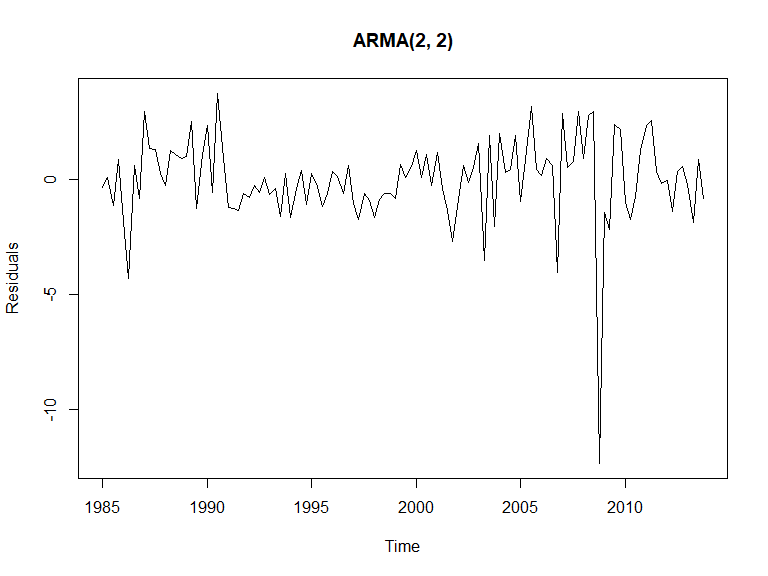<!-- -->

``` r
aux <- acf2(ARMA25$residuals, main = 'ARMA(2, 5)')
```

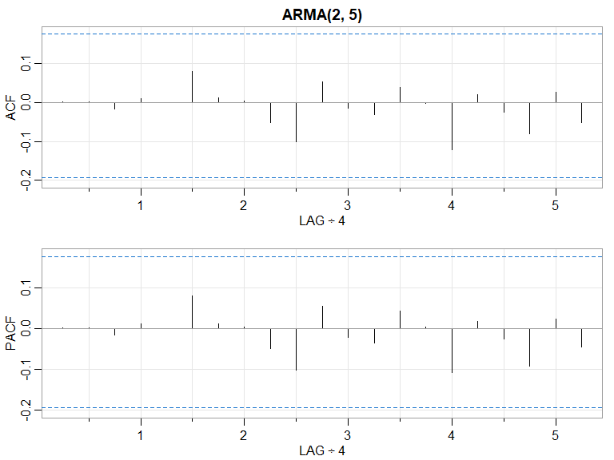<!-- -->

``` r
aux <- acf2(ARMA22$residuals, main = 'ARMA(2, 2)')
```

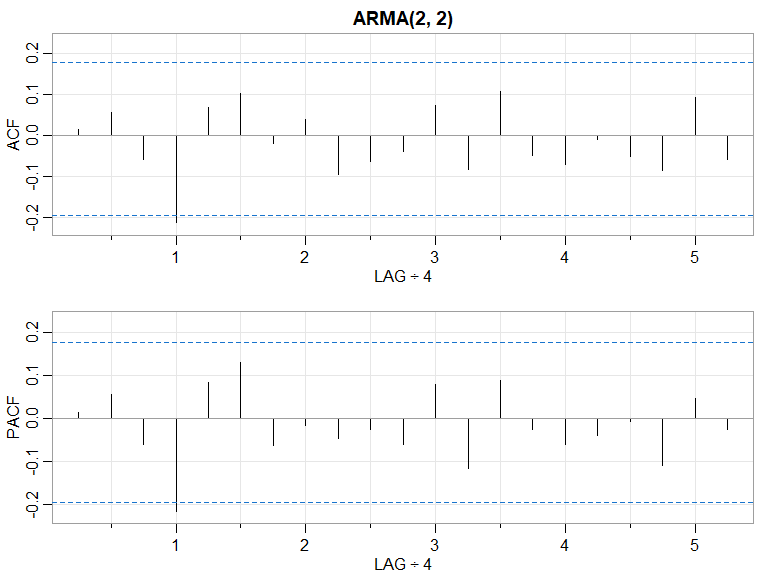<!-- -->

``` r
Box.test(ARMA25$residuals, lag = 4, type = c("Ljung-Box"))
```

    ## 
    ##  Box-Ljung test
    ## 
    ## data:  ARMA25$residuals
    ## X-squared = 0.047509, df = 4, p-value = 0.9997

``` r
Box.test(ARMA22$residuals, lag = 4, type = c("Ljung-Box"))
```

    ## 
    ##  Box-Ljung test
    ## 
    ## data:  ARMA22$residuals
    ## X-squared = 6.3105, df = 4, p-value = 0.1771

There’s concern related to the ACF/PACF plot for the ARMA(2, 2) model
since the ACF and PACF are both significantly different from 0 at lag 1,
however, the Ljung-Box test indicates the hypothesis of white noise
cannot be rejected. Therefore, both models seem to be adequate.

## Rolling window forecast accuracy

### ARMA(2,5)

``` r
inf.fore <- matrix(NA, 146, 8)
colnames(inf.fore) <- c("date" ,"observed", "fitted", "forecast", "lo80", "hi80", "lo95", "hi95")
inf.fore = as.data.frame(inf.fore)
inf.fore$date <- as.Date(time(cpi_inflation))
inf.fore$observed <- cpi_inflation
all_fit <- matrix(NA, 117, 29)
for(i in 1:29){
  b = i
  e = 117 + i - 1
  p = e + 1
  inf25.sub <- cpi_inflation[b:e]
  inf25.mod <- arima(inf25.sub, order = c(2, 0, 5))
  inf25.pred <- forecast(inf25.sub, model = inf25.mod, h = 1)
  fit <- inf25.pred$fitted
  all_fit[, i] <- fit
  inf.fore[p, 4:8] <- as.data.frame(inf25.pred)
}
inf.fore[1:117, 3] <- all_fit[, 1]
ggplot_forecast(inf.fore)
```

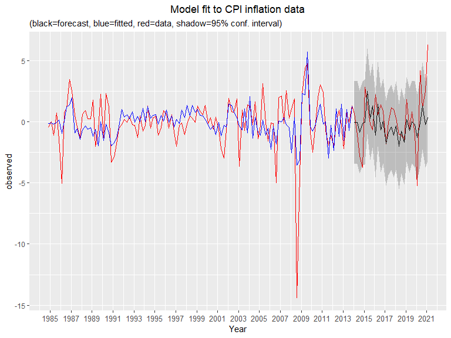<!-- -->

### ARMA(2,2)

``` r
inf1.fore <- matrix(NA, 146, 8)
colnames(inf1.fore) <- c("date" ,"observed", "fitted", "forecast", "lo80", "hi80", "lo95", "hi95")
inf1.fore = as.data.frame(inf1.fore)
inf1.fore$date <- as.Date(time(cpi_inflation))
inf1.fore$observed <- cpi_inflation
all_fit1 <- matrix(NA, 117, 29)
for(i in 1:29){
  b = i
  e = 117 + i - 1
  p = e + 1
  inf22.sub <- cpi_inflation[b:e]
  inf22.mod <- arima(inf22.sub, order = c(2, 0, 2))
  inf22.pred <- forecast(inf22.sub, model = inf22.mod, h = 1)
  fit1 <- inf22.pred$fitted
  all_fit1[, i] <- fit1
  inf1.fore[p, 4:8] <- as.data.frame(inf22.pred)
}
inf1.fore[1:117, 3] <- all_fit1[, 1]
ggplot_forecast(inf1.fore)
```

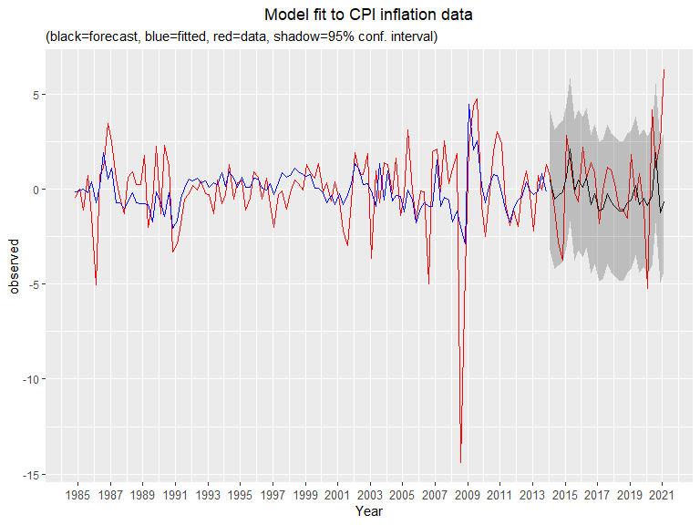<!-- -->

### MSFE and MAFE comparison

``` r
MSFE = c(mean( ((inf.fore$observed-inf.fore$forecast)^2)[118:146]), mean( ((inf1.fore$observed-inf1.fore$forecast)^2)[118:146]))
MAFE = c(mean( (abs(inf.fore$observed-inf.fore$forecast)[118:146])), mean( (abs(inf1.fore$observed-inf1.fore$forecast)[118:146])))
error.all <- rbind(MSFE, MAFE)
rownames(error.all) <- c('MSFE', 'MAFE')
colnames(error.all) <- c('ARMA(2,5)', 'ARMA(2,2)')
error.all
```

    ##      ARMA(2,5) ARMA(2,2)
    ## MSFE  4.754118  5.398399
    ## MAFE  1.648895  1.688627

ARMA(2, 5) seems to be the more adequate model since it produces both
lower MSFE and MAFE.

### Forecast for the next 4 quarters with an ARMA(2,5) model

``` r
ARMA25 <- arima(cpi_inflation, order = c(2, 0, 5))
ARMA25_forecast <- forecast(cpi_inflation, model = ARMA25, h = 4)
autoplot(ARMA25_forecast)
```

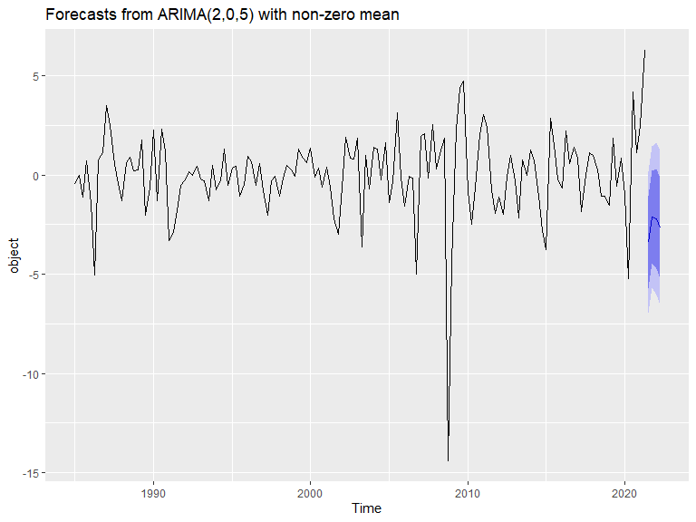<!-- -->

# GARCH

## Check the stationarity assumption by testing for unit root

``` r
test.df <- ur.df(cpi_inflation, type = "drift", lags = 0)
res.df <- data.frame(as.vector(test.df@teststat),
                     test.df@cval) 
names(res.df) <- c("Stat","CI 1pct", "CI 5pct", "CI 10pct")
xtable(res.df) %>%
  kable(digits=2) 
```

<table>
<thead>
<tr>
<th style="text-align:left;">
</th>
<th style="text-align:right;">
Stat
</th>
<th style="text-align:right;">
CI 1pct
</th>
<th style="text-align:right;">
CI 5pct
</th>
<th style="text-align:right;">
CI 10pct
</th>
</tr>
</thead>
<tbody>
<tr>
<td style="text-align:left;">
tau2
</td>
<td style="text-align:right;">
-9.87
</td>
<td style="text-align:right;">
-3.46
</td>
<td style="text-align:right;">
-2.88
</td>
<td style="text-align:right;">
-2.57
</td>
</tr>
<tr>
<td style="text-align:left;">
phi1
</td>
<td style="text-align:right;">
48.71
</td>
<td style="text-align:right;">
6.52
</td>
<td style="text-align:right;">
4.63
</td>
<td style="text-align:right;">
3.81
</td>
</tr>
</tbody>
</table>

Since *τ*<sub>2</sub> is much smaller than its critical value and
*ϕ*<sub>1</sub> is much bigger than its critical value, we can conclude
that the inflation series is stationary.

Check the square of the inflation series to find the appropriate orders
of the GARCH model

``` r
aux <- acf2(cpi_inflation^2)
```

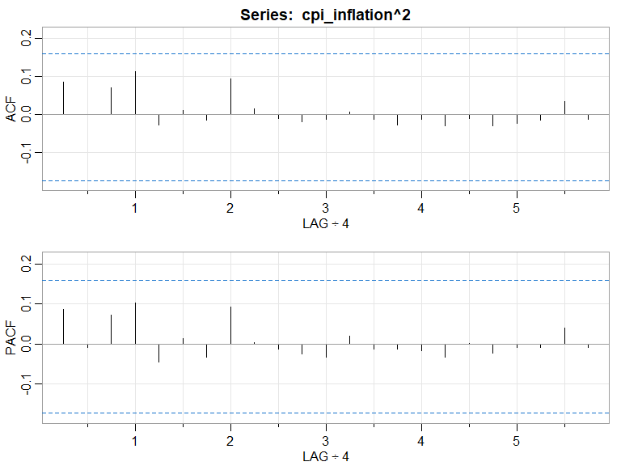<!-- -->

None of the lag seems to be statistically significant.

Again, proceed to select the “best model” within GARCH(2 ± 2,2 ± 2) base
on their BIC value in the training data

``` r
all.ar <- c(0, 1, 2, 3, 4)
all.ch <- c(0, 1, 2, 3, 4)
all.GARCH <- expand.grid(ar = all.ar, ch = all.ch)[-1, ] # Remove ARCH(0, 0) since its no different than estimating the conditional mean model on its own
n.GARCH <- nrow(all.GARCH)
bic.GARCH <- matrix(NA, n.GARCH, 1)
rownames(bic.GARCH) <- paste0("GARCH(", all.GARCH$ar,",",
all.GARCH$ch, ")")
colnames(bic.GARCH) <- "BIC"
for(i in 1:n.GARCH){
  spec <- ugarchspec(variance.model = list(model = 'sGARCH',
                     garchOrder = c(all.GARCH[i, 1], all.GARCH[i, 2])), 
                     mean.model = list(armaOrder = c(2, 5),
                     include.mean = F))
  model = ugarchfit(data = inf.train, spec, solver = "hybrid")
  bic.GARCH[i, 1] = infocriteria(model)[2, 1]
}
kable(bic.GARCH)
```

<table>
<thead>
<tr>
<th style="text-align:left;">
</th>
<th style="text-align:right;">
BIC
</th>
</tr>
</thead>
<tbody>
<tr>
<td style="text-align:left;">
GARCH(1,0)
</td>
<td style="text-align:right;">
4.307206
</td>
</tr>
<tr>
<td style="text-align:left;">
GARCH(2,0)
</td>
<td style="text-align:right;">
4.209485
</td>
</tr>
<tr>
<td style="text-align:left;">
GARCH(3,0)
</td>
<td style="text-align:right;">
4.333981
</td>
</tr>
<tr>
<td style="text-align:left;">
GARCH(4,0)
</td>
<td style="text-align:right;">
4.357752
</td>
</tr>
<tr>
<td style="text-align:left;">
GARCH(0,1)
</td>
<td style="text-align:right;">
4.505780
</td>
</tr>
<tr>
<td style="text-align:left;">
GARCH(1,1)
</td>
<td style="text-align:right;">
4.290879
</td>
</tr>
<tr>
<td style="text-align:left;">
GARCH(2,1)
</td>
<td style="text-align:right;">
4.214718
</td>
</tr>
<tr>
<td style="text-align:left;">
GARCH(3,1)
</td>
<td style="text-align:right;">
4.289282
</td>
</tr>
<tr>
<td style="text-align:left;">
GARCH(4,1)
</td>
<td style="text-align:right;">
4.313691
</td>
</tr>
<tr>
<td style="text-align:left;">
GARCH(0,2)
</td>
<td style="text-align:right;">
4.553720
</td>
</tr>
<tr>
<td style="text-align:left;">
GARCH(1,2)
</td>
<td style="text-align:right;">
4.396151
</td>
</tr>
<tr>
<td style="text-align:left;">
GARCH(2,2)
</td>
<td style="text-align:right;">
4.255919
</td>
</tr>
<tr>
<td style="text-align:left;">
GARCH(3,2)
</td>
<td style="text-align:right;">
4.521453
</td>
</tr>
<tr>
<td style="text-align:left;">
GARCH(4,2)
</td>
<td style="text-align:right;">
4.357303
</td>
</tr>
<tr>
<td style="text-align:left;">
GARCH(0,3)
</td>
<td style="text-align:right;">
4.523659
</td>
</tr>
<tr>
<td style="text-align:left;">
GARCH(1,3)
</td>
<td style="text-align:right;">
4.458107
</td>
</tr>
<tr>
<td style="text-align:left;">
GARCH(2,3)
</td>
<td style="text-align:right;">
4.339878
</td>
</tr>
<tr>
<td style="text-align:left;">
GARCH(3,3)
</td>
<td style="text-align:right;">
4.357303
</td>
</tr>
<tr>
<td style="text-align:left;">
GARCH(4,3)
</td>
<td style="text-align:right;">
4.398282
</td>
</tr>
<tr>
<td style="text-align:left;">
GARCH(0,4)
</td>
<td style="text-align:right;">
4.519208
</td>
</tr>
<tr>
<td style="text-align:left;">
GARCH(1,4)
</td>
<td style="text-align:right;">
4.421975
</td>
</tr>
<tr>
<td style="text-align:left;">
GARCH(2,4)
</td>
<td style="text-align:right;">
4.350208
</td>
</tr>
<tr>
<td style="text-align:left;">
GARCH(3,4)
</td>
<td style="text-align:right;">
4.391187
</td>
</tr>
<tr>
<td style="text-align:left;">
GARCH(4,4)
</td>
<td style="text-align:right;">
4.554091
</td>
</tr>
</tbody>
</table>

ARCH(2) seems to be the most appropriate model since it produces the
lowest BIC.

## Model Estimation and diagnostic check

``` r
arch2 <- ugarchspec(variance.model = list(model = 'sGARCH',
                    garchOrder = c(2, 0)), mean.model = list(armaOrder = c(2, 5),
                                                             include.mean = F))
(ARCH2 <- ugarchfit(data = inf.train, arch2))
```

    ## 
    ## *---------------------------------*
    ## *          GARCH Model Fit        *
    ## *---------------------------------*
    ## 
    ## Conditional Variance Dynamics    
    ## -----------------------------------
    ## GARCH Model  : sGARCH(2,0)
    ## Mean Model   : ARFIMA(2,0,5)
    ## Distribution : norm 
    ## 
    ## Optimal Parameters
    ## ------------------------------------
    ##         Estimate  Std. Error    t value Pr(>|t|)
    ## ar1    -0.883150    0.070137  -12.59174 0.000000
    ## ar2     0.092367    0.065740    1.40504 0.160009
    ## ma1     1.027360    0.002678  383.66004 0.000000
    ## ma2    -0.179213    0.014663  -12.22213 0.000000
    ## ma3    -0.200243    0.020335   -9.84740 0.000000
    ## ma4    -0.522787    0.004553 -114.82219 0.000000
    ## ma5    -0.582608    0.002251 -258.86624 0.000000
    ## omega   1.186933    0.314846    3.76988 0.000163
    ## alpha1  0.020637    0.029089    0.70944 0.478052
    ## alpha2  0.880271    0.279488    3.14959 0.001635
    ## 
    ## Robust Standard Errors:
    ##         Estimate  Std. Error  t value Pr(>|t|)
    ## ar1    -0.883150    0.087839 -10.0542 0.000000
    ## ar2     0.092367    0.076894   1.2012 0.229663
    ## ma1     1.027360    0.003523 291.5806 0.000000
    ## ma2    -0.179213    0.013652 -13.1275 0.000000
    ## ma3    -0.200243    0.009808 -20.4156 0.000000
    ## ma4    -0.522787    0.010799 -48.4110 0.000000
    ## ma5    -0.582608    0.007315 -79.6442 0.000000
    ## omega   1.186933    0.484515   2.4497 0.014296
    ## alpha1  0.020637    0.011262   1.8324 0.066891
    ## alpha2  0.880271    0.533652   1.6495 0.099040
    ## 
    ## LogLikelihood : -220.3822 
    ## 
    ## Information Criteria
    ## ------------------------------------
    ##                    
    ## Akaike       3.9721
    ## Bayes        4.2095
    ## Shibata      3.9588
    ## Hannan-Quinn 4.0685
    ## 
    ## Weighted Ljung-Box Test on Standardized Residuals
    ## ------------------------------------
    ##                          statistic p-value
    ## Lag[1]                      0.8734  0.3500
    ## Lag[2*(p+q)+(p+q)-1][20]    8.2313  1.0000
    ## Lag[4*(p+q)+(p+q)-1][34]   12.4130  0.9614
    ## d.o.f=7
    ## H0 : No serial correlation
    ## 
    ## Weighted Ljung-Box Test on Standardized Squared Residuals
    ## ------------------------------------
    ##                         statistic p-value
    ## Lag[1]                     0.2123  0.6449
    ## Lag[2*(p+q)+(p+q)-1][5]    1.9942  0.6198
    ## Lag[4*(p+q)+(p+q)-1][9]    3.3126  0.7064
    ## d.o.f=2
    ## 
    ## Weighted ARCH LM Tests
    ## ------------------------------------
    ##             Statistic Shape Scale P-Value
    ## ARCH Lag[3]     1.455 0.500 2.000  0.2277
    ## ARCH Lag[5]     2.779 1.440 1.667  0.3235
    ## ARCH Lag[7]     3.351 2.315 1.543  0.4498
    ## 
    ## Nyblom stability test
    ## ------------------------------------
    ## Joint Statistic:  2.4116
    ## Individual Statistics:              
    ## ar1    0.07299
    ## ar2    0.05369
    ## ma1    0.21361
    ## ma2    0.17343
    ## ma3    0.12192
    ## ma4    0.10878
    ## ma5    0.09809
    ## omega  0.18672
    ## alpha1 0.06150
    ## alpha2 0.12428
    ## 
    ## Asymptotic Critical Values (10% 5% 1%)
    ## Joint Statistic:          2.29 2.54 3.05
    ## Individual Statistic:     0.35 0.47 0.75
    ## 
    ## Sign Bias Test
    ## ------------------------------------
    ##                    t-value    prob sig
    ## Sign Bias           1.9118 0.05848   *
    ## Negative Sign Bias  0.3785 0.70577    
    ## Positive Sign Bias  1.5087 0.13422    
    ## Joint Effect        3.7297 0.29218    
    ## 
    ## 
    ## Adjusted Pearson Goodness-of-Fit Test:
    ## ------------------------------------
    ##   group statistic p-value(g-1)
    ## 1    20     19.52      0.42414
    ## 2    30     34.00      0.23926
    ## 3    40     39.17      0.46214
    ## 4    50     67.62      0.04004
    ## 
    ## 
    ## Elapsed time : 0.3923559

The model seems to be adequate since it passes all the diagnostic check
at the 5% level of significance, the only concern is both
*α*<sub>1</sub> and *α*<sub>2</sub> are statistically insignificant at
the 5% level under the robust standard errors.

## Rolling window forecast accuracy

### ARCH(2)

``` r
inf2.fore <- matrix(NA, 146, 8)
colnames(inf2.fore) <- c("date" ,"observed", "fitted", "forecast", "lo80", "hi80", "lo95", "hi95")
inf2.fore = as.data.frame(inf2.fore)
inf2.fore$date <- as.Date(time(cpi_inflation))
inf2.fore$observed <- cpi_inflation
all_fit2 <- matrix(NA, 117, 29)

for(i in 1:29){
  b = i
  e = 117 + i - 1
  p = e + 1
  inf2.sub <- cpi_inflation[b:e]
  inf2.spec <- ugarchspec(variance.model = list(model = 'sGARCH',
                          garchOrder = c(2, 0)), 
                          mean.model = list(armaOrder = c(2, 5),
                          include.mean = F))
  inf2.mod <- ugarchfit(data = inf2.sub, inf2.spec, solver = "hybrid")
  inf2.pred <- ugarchforecast(inf2.mod, n.ahead = 1)
  fit <- inf2.mod@fit$fitted.values
  all_fit2[, i] <- fit
  prediction <- inf2.pred@forecast$seriesFor[1, 1]
  sigma <- inf2.pred@forecast$sigmaFor[1, 1]
  inf2.fore[p, 4:8] <- as.data.frame(matrix(c(prediction, prediction - 1.28*sigma, 
                                              prediction + 1.28*sigma, prediction - 1.96*sigma,
                                              prediction + 1.96*sigma), 1, 5))
}
inf2.fore[1:117, 3] <- all_fit2[, 1]
ggplot_forecast(inf2.fore)
```

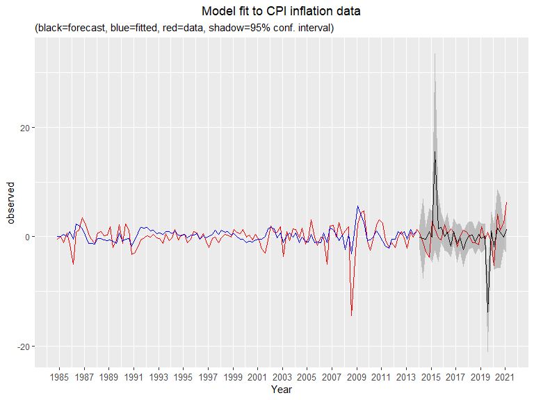<!-- -->

### MSFE and MAFE comparison

``` r
(error.all <- cbind(error.all, "ARCH(2)" = c(mean(((inf2.fore$observed - inf2.fore$forecast)^2)[118:146]),
                                         mean((abs(inf2.fore$observed - inf2.fore$forecast)[118:146])))))
```

    ##      ARMA(2,5) ARMA(2,2)   ARCH(2)
    ## MSFE  4.754118  5.398399 19.006888
    ## MAFE  1.648895  1.688627  2.685408

Unsurprisingly, the ARCH(2) model does not perform better than the
ARMA(2, 5) mainly due to the two spikes in the forecast near year 2015
and 2019. Therefore, the ARMA(2,5) forecast is the best model available.

<!-- ### Recursive forecast to compare MSFE and MAFE for all possible ARMA and GARCH models -->
<!-- ```{r} -->
<!-- library(doParallel) -->
<!-- cl <- makePSOCKcluster(5) -->
<!-- registerDoParallel(cl) -->
<!-- AR <- c(2, 3, 4, 5, 6) -->
<!-- MA <- c(2, 3, 4, 5, 6) -->
<!-- ARMA <- expand.grid(AR = AR, MA = MA) -->
<!-- n1.ARMA <- nrow(ARMA) -->
<!-- ALL_error <- matrix(NA, n1.ARMA, 2) -->
<!-- rownames(ALL_error) <- paste0("ARMA(", ARMA$AR,",", -->
<!-- ARMA$MA, ")") -->
<!-- colnames(ALL_error) <- c("MSFE", "MAFE") -->
<!-- for(f in 1:n1.ARMA){ -->
<!--   print(paste0(f, " out of ", n1.ARMA)) -->
<!--   a = ARMA[f, 1] -->
<!--   q = ARMA[f, 2] -->
<!--   ret.fore1 <- matrix(NA, 29, 2) -->
<!--   for(i in 1:29){ -->
<!--     tryCatch({ -->
<!--     b = i -->
<!--     e = 117 + i - 1 -->
<!--     p = e + 1 -->
<!--     ret.sub <- cpi_inflation[b:e] -->
<!--     ret.mod <- arima(ret.sub, order = c(a, 0, q)) -->
<!--     ret.pred <- forecast(ret.sub, model = ret.mod, h = 1) -->
<!--     ret.fore1[i, ] <- cbind(cpi_inflation[p], ret.pred$mean)} -->
<!--     , error = function(e){cat("ERROR :",conditionMessage(e), "\n")}) -->
<!--   } -->
<!--   ALL_error[f, 1] = mean((ret.fore1[, 1] - ret.fore1[, 2])^2) -->
<!--   ALL_error[f, 2] = mean(abs(ret.fore1[, 1] - ret.fore1[, 2])) -->
<!-- }   -->
<!-- ar <- c(0, 1, 2, 3, 4) -->
<!-- ch <- c(0, 1, 2, 3, 4) -->
<!-- ARCH <- expand.grid(ar = ar, ch = ch)[-1,] -->
<!-- n1.ARCH <- nrow(ARCH) -->
<!-- ALL2_error <- matrix(NA, n1.ARCH, 2) -->
<!-- rownames(ALL2_error) <- paste0("ARCH(", ARCH$ar,",", -->
<!-- ARCH$ch, ")") -->
<!-- colnames(ALL2_error) <- c("MSFE", "MAFE") -->
<!-- for(f in 1:n1.ARCH){ -->
<!--   print(paste0(f, " out of ", n1.ARCH)) -->
<!--   a = ARCH[f, 1] -->
<!--   q = ARCH[f, 2] -->
<!--   ret.fore2 <- matrix(NA, 29, 2) -->
<!--   for(i in 1:29){ -->
<!--     tryCatch({ -->
<!--     b = i -->
<!--     e = 117 + i - 1 -->
<!--     p = e + 1 -->
<!--     ret.sub <- cpi_inflation[b:e] -->
<!--     spec <- ugarchspec(variance.model = list(model = 'sGARCH', -->
<!--                      garchOrder = c(a, q)),  -->
<!--                      mean.model = list(armaOrder = c(2, 5), -->
<!--                      include.mean = F)) -->
<!--     model = ugarchfit(data = ret.sub, spec, solver = "hybrid") -->
<!--     pred <- ugarchforecast(model, n.ahead = 1) -->
<!--     ret.fore2[i, ] <- cbind(cpi_inflation[p], pred@forecast$seriesFor[1, 1])} -->
<!--     , error = function(e){cat("ERROR :",conditionMessage(e), "\n")}) -->
<!--   } -->
<!--   ALL2_error[f, 1] = mean((ret.fore2[, 1] - ret.fore2[, 2])^2) -->
<!--   ALL2_error[f, 2] = mean(abs(ret.fore2[, 1] - ret.fore2[, 2])) -->
<!-- }   -->
<!-- rbind(ALL_error, ALL2_error) -->
<!-- stopCluster(cl) -->
<!-- ``` -->
<!-- GARCH(1,3) is the most appropriate model given the results. -->
<!-- ### Estimation of GARCH(1,3) -->
<!-- ```{r} -->
<!-- arch13 <- ugarchspec(variance.model = list(model = 'sGARCH', garchOrder = c(1, 3)),  -->
<!--                      mean.model = list(armaOrder = c(2, 5), -->
<!--                      include.mean = F)) -->
<!-- ARCH13 <- ugarchfit(data = cpi_inflation, arch13) -->
<!-- ugarchforecast(ARCH13, n.ahead = 4) -->
<!-- ``` -->

## 
